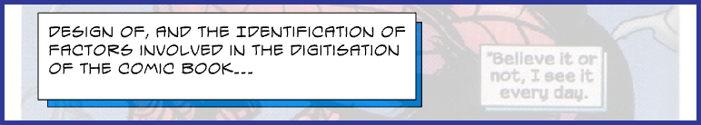

Materials from my dissertation submitted in support of my Master of Arts in Digital Culture and Technology at Kings College London (2005).

## Full paper

The full paper can be found via [my blog](https://exponentialdecay.co.uk/blog/wp-content/uploads/2013/08/ross-spencer-digitisation-of-the-comic-book.pdf).

### Survey

A survey was created for the dissertation with results available [here](https://docs.google.com/spreadsheets/d/1xevGclFUS8MGGgz0Hxq1v6juxK-_6mgFCGFTVsdmdqI/edit?usp=sharing) as a Google Sheet.

### Death and the Maidens SWF

A flash presentaiton of Death and the Maidens can be found [here](DeathAndTheMaidens.swf).

> _Consider using [Ruffle](https://ruffle.rs/) to view SWF files._

### GBA outputs

A Peanuts comic strip was converted to a GBA game format [here](peanuts.gba).

## Final blog

I have written the experience of writing this [here](https://exponentialdecay.co.uk/blog/looking-back-mmv-ma-digital-culture-and-technology-digitisation-of-the-comic-book/). Most of the materials are accessible there as it is quite onerous to copy-and-paste those here.

## Proposal

The dissertation proposal can be found [here](proposal.html#proposal-design-of-and-the-identification-of-factors-involved-in-the-digitisation-of-the-comic-book).

### Proposal Presentation

In preparation for writing, we were asked to show a preliminary presentation. I wrote mine using Flash.

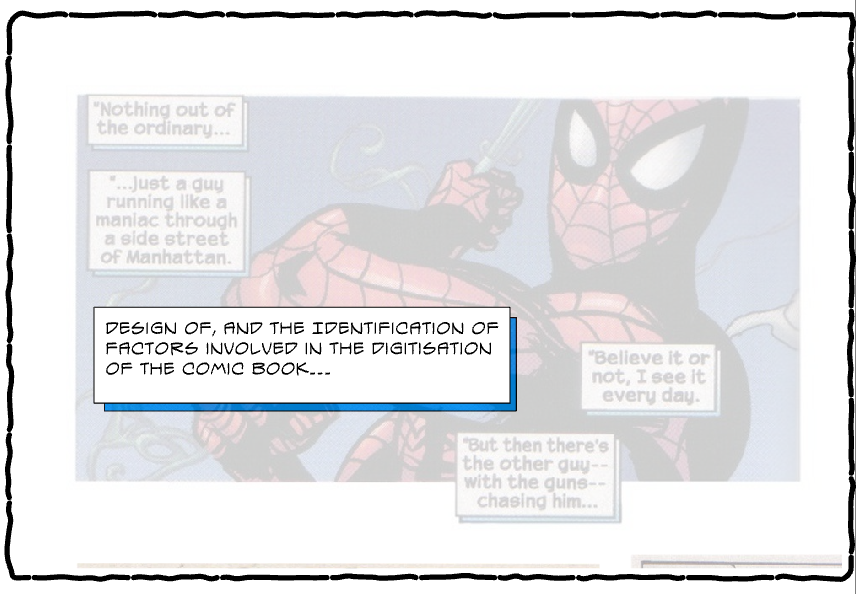

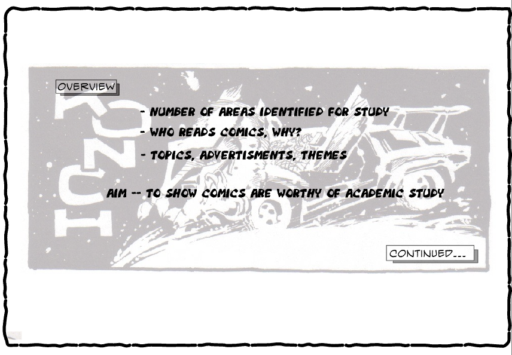

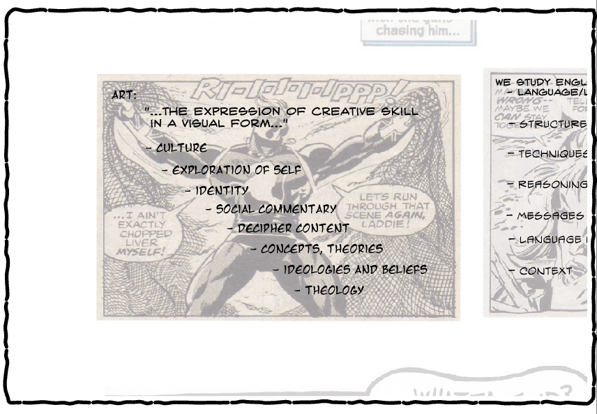

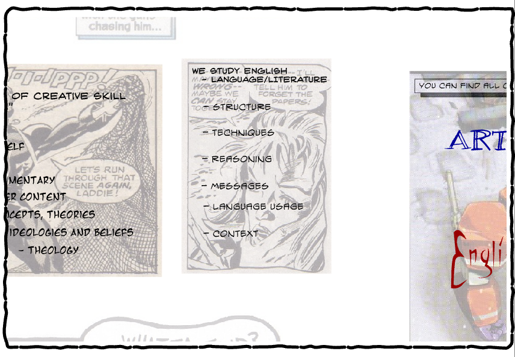

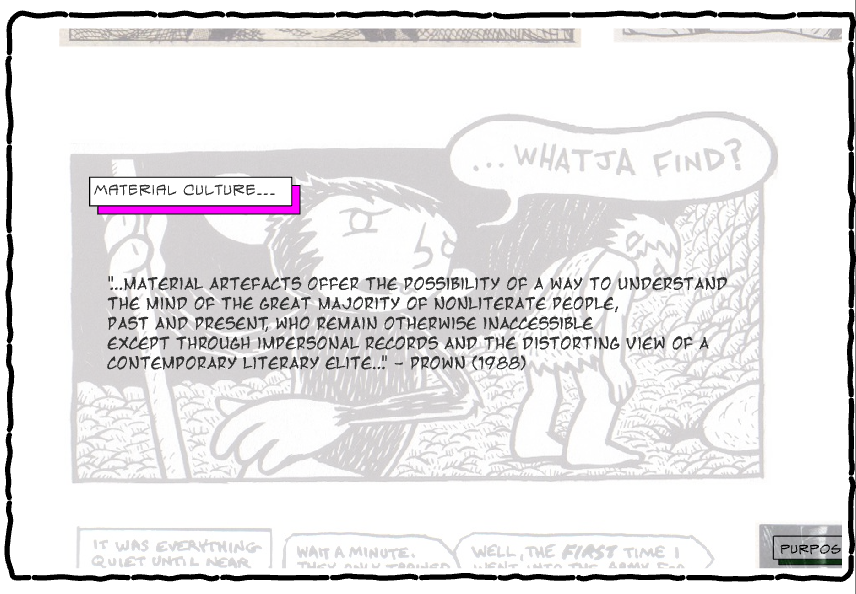

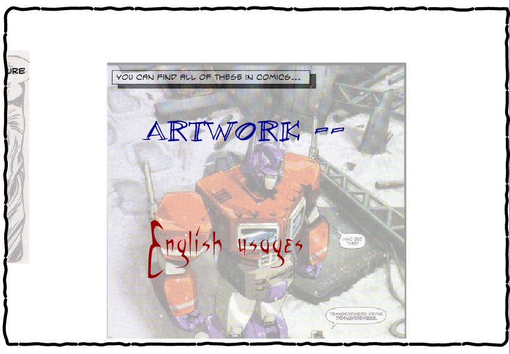

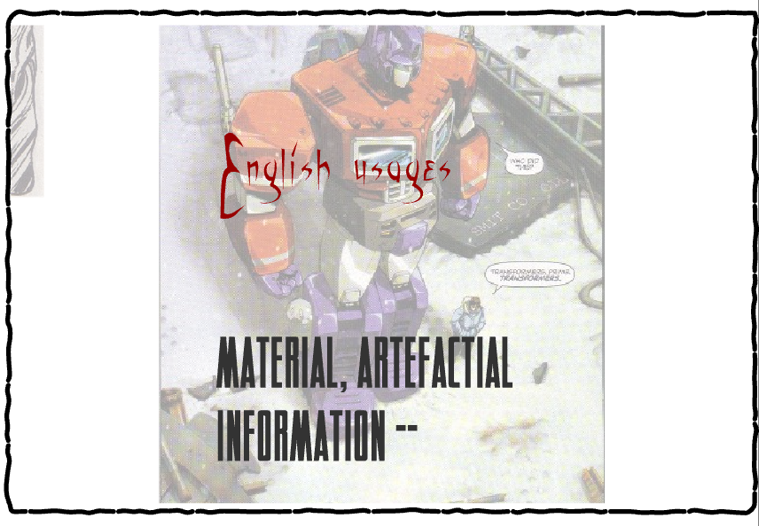

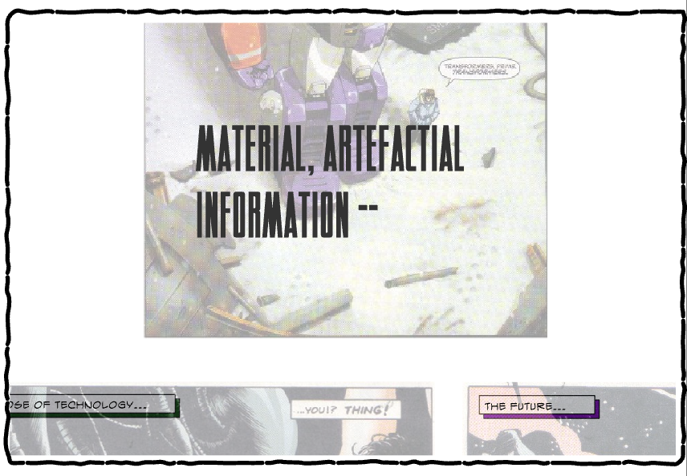

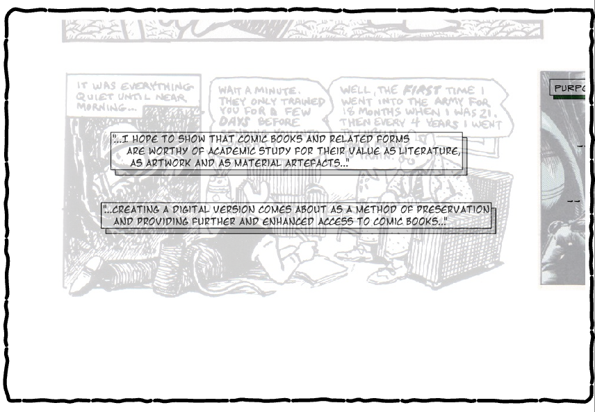

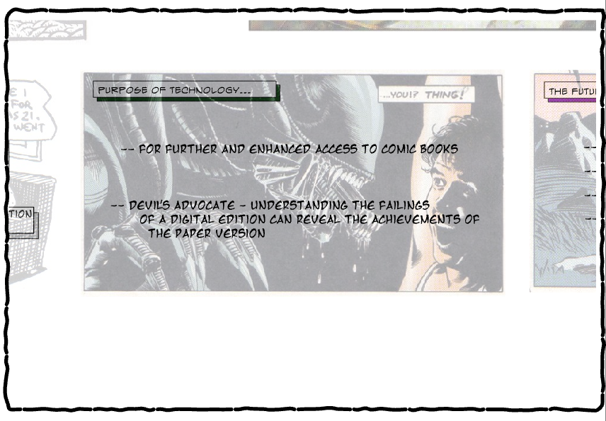

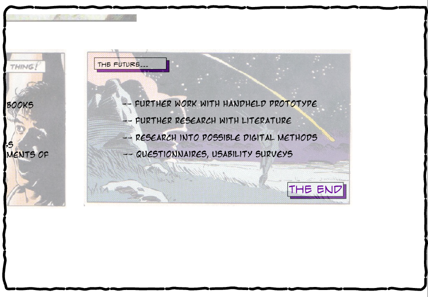

via. [Presentation as Flash SWF](proposal.swf)

> _Consider using [Ruffle](https://ruffle.rs/) to view SWF files._
