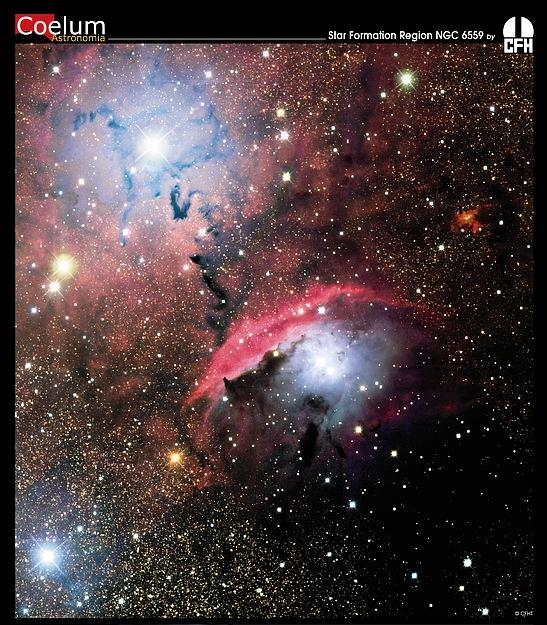
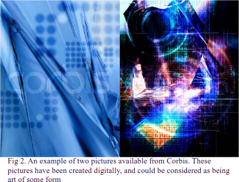
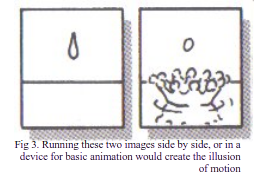
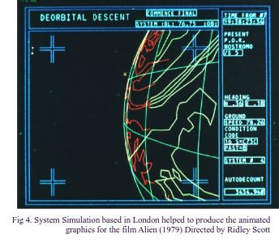
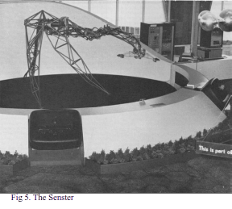
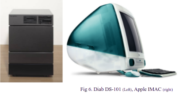

The topic of digital art looks at how the computer has affected artistic expression since its emergence form research institutions in the early 50’s. Although Ada Byron Lovelace in the 1800’s speculated that the computer would facilitate composition of complex music and be capable of producing graphics it has only been since the widening levels of access to the computer that it has been used for more creative purposes.

The computer can be used in several creative ways, from allowing the user to create a digital art form such as a digital image or allowing users to control a piece of art by providing levels of interaction with viewers or simply controlling the output of a sculpture or installation. The various ways in which the computer can be used shall be looked at in more detail below using actual pieces to highlight its uses. There are questions raised about what constitutes art on the computer and what constitutes a simple computer program, graphical routine, or a various other number of processes on the computer. This debate shall be looked at briefly after I have discussed what can be creatively achieved using the computer:

## Static Digital Images

Images can be represented digitally. Images can be scanned and the corresponding bitmap displayed on screen, they can be photographed digitally, uploaded and the bitmap displayed. Alternatively digital static images can be created using digital paint tools, and by using a combination of paint tools and actual photography or graphics. There is a wide range of tools to support creating static digital images from the software to the hardware, and the peripherals.

Software is an important core component of creating a digital image; two packages of interest are Paint Shop Pro by Corel, and Adobe Photoshop. Both packages allow users to access a wide range of drawing tools, textures, effects, pallets and many other facilities that allow users to create images on screen. Other packages that exist to allow users to create digital images include Computer Aided Design (CAD) and vector drawing packages such as CorelDraw.

Input devices exist to allow artists to use the computer like a drawing pad. The mouse is a useful tool, but for those that do not find it flexible enough, drawing pens and graphics tablets exist so that the user can make use of the screen in the same way they would use pencil and paper. Monitors and graphics card are of importance in terms of size, resolution and colours that can be accessed and used by an artist to create images. An image can exist of photographic components as well. Digital cameras and scanners facilitate this combination and the improving memory capabilities and visual capabilities of both scanners and cameras, plus the connectivity provided by USB and Fire wire mean that images the same quality as actual photographs can be immediately accessed and manipulated on screen.

Digital imaging itself is being used more and more on the web. Image resources are available for teachers at places like SCRAN.ac.uk, galleries such as the national gallery London and Tate gallery are making more images available of artwork for everyone with access over the web. Actual Digital artwork is becoming more and more prevalent. One notable resource is the Ars Electronica, a gallery situated in Austria, with access to work online. The gallery focuses on digital art of all kinds from digital sculptures and installations, to mixed digital media to the static image.

Digital images can be found in our every day lives on our computer desktops, in advertising campaigns on billboards, or even on the front cover of books we may read. One example of where digital techniques are applied to real life situation is the pseudo colouring techniques applied to photographs of star systems taken from powerful telescopes, see figure 1.

> Figure 1: An example of pseudo colouring applied to space
photography, creating a unique and individual image.

While not necessarily considered artwork in the traditional sense that it conveys some element of meaning, or will necessarily be discovered in an art gallery, imaging such as that in figure 1 is only possible because of digital techniques and allows scientists to learn much more about what they are seeing through telescopes because of the detail revealed through additional colour detail.

Figure 1\. Can also be looked at as a picture that is aesthetically pleasing and therefore it is likely that it could be found displayed in a home, or a local bar, for interest, or simply because it looks good.

Artwork created from scratch, digitally, can be discovered on websites such at Corbis.com, which provides web resource images of all types. Corbis allows users to access illustrations, digital captures of artwork, digital graphics and a wide resource of other types of image. These images include digital images such as those in figure 2.

> Figure 2: An example of two pictures available from Corbis. These pictures have been created digitally, and could be considered as being art of some form.

With many people being able to access the computer and with more and more people becoming interested in using the computer for more than just word processing, it means more people are willing to experiment with what tools are available. Children are able to pick up Microsoft paint from a young age; their first picture of the family pet using paint could be considered digital art. Access to these tools is reflected online with a wide number of resources and galleries available for users to exhibit their work with limited discrimination to what is shown. From the simple, to the complicated, and from the mundane to the exotic, if people can find a suitable place for exhibit online then it is possible for them to do so. It is also possible for artists to host their own work themselves making their entire portfolio known to the public.

## Sculpt Materials in Three Dimensions

Computer Aided Design (CAD), mentioned briefly above, allows users to create 3D visualisations of objects on screen. CAD can be used to model anything from a cube to a building; architects have used it for the latter purpose for a number of decades. Engineers also make use of CAD, and combining it with tools such as Computer Aided Manufacturing (CAM) it allows them to gain complete control over the machine they are operating. CAM will convert the drawings and measurements created using CAD into a series of instructions that are translated into a machines movements when drilling a hole, cutting metal, or even carving a piece of wood. Wood can be embossed and engraved or moulds can be created for shaping plastic and metal.

More creatively the tools of CAD and CAM can be used to sculpt objects that have been designed by artists. These tools together can be used to create jewellery, statues, and other artificial objects such as units of a larger sculpture, or detailed objects in their own right.

## Create a Linear Animation

A definition of Animation is to make, design, or produce a cartoon so as to create the illusion of motion.

An animation can be made by the juxtaposition of two or more images. The images should be almost identical, bar a subtle change in either of the two that depicts an object or person within the image as being in motion, such as a subtle gesture of the arm, or the image in Figure 3. which depicts a droplet of water falling into a larger body of water.

> Figure 3: Running these two images side by side, or in a device for basic animation would create the illusion of motion

There are only two images in figure three but they can be animated using a device called a thaumatrope. A thaumatrope is a cardboard disk with two strings attached to it. The circling of the disk using the strings to rotate it back and forth creates the illusion of the droplet falling into the body of water.

Other manual animation devices that can be used are the flipbook, the phenakistoscope or the zoetrope.

The combination of film and manual animation techniques lead to greater automation in the field of animation. Animation by the likes of Disney and Warner Brothers, were of extreme importance for their popularity among the public, but also their combination of animation and film pushing the boundaries between live-action cinema and cartoons.

The history of the computer and animation began in 1967\. Tony Pritchet in 1967 is credited with the creation of the first computer-animated film. The animation was drawn by hand and animated using a university of London Atlas computer. The animation also made use of profound sound that was combined with the animation using the computer.

Since 1967 there have been many advances in the field of computing and animation. Sylvester Squirrel created by Alan Kitching, and work in films completed by companies such as System Simulation are of particular importance to the British role in the history of digital animation. The computer on the space mining ship featured in the film alien is one example of the animation work being done (fig 4.):

> Figure 4: System Simulation based in London helped to produce the animated graphics for the film Alien (1979) Directed by Ridley Scott

The advances in this area have resulted in the first full-length computer generated feature film – Toy Story being released in 1995\. The creation of Toy Story required 800,000 hours to be generated on computers, consisting of 87 2-CPU Sun Microsystems SparcStation 20’s, 30 4-CPU Sun SparcStation 20’s and a single Sun SparcServer 1000\. The film runs 81 Minutes in length and in complete colour and Dolby Digital surround sound.

There are now a large number of movies being created using just computer animation; titles include Monsters Inc. (2001), and Madagascar (2005). Each new film pushing the boundaries between the content you would expect in live-action cinema and what would fundamentally be considered a cartoon; creating almost a new art form in itself. However, a feature of modern computer animation is how close they can make an animated character look like a real human being, from skin texture to the movement of the hair on the head to the number of individually animated hair strands that can be seen in a movie. The furry character Sully in monsters inc. noted as an achievement for the animation of over 2,320,413 hairs, taking around 11 to 12 hours to animate a single frame that included this character. The movie Final Fantasy: The Spirits Within (2001), created by Squaresoft/Square Pictures a computer games company/film studio noted as an achievement for featuring only computer generated ‘photo-realistic’ actors and locations.

The techniques used have been taken to such a level where the computer generated ‘photo-realistic’ actors featured in a computer generated movie can now star alongside real actors in live-action movies, the three ‘prequel-trilogy’ Star Wars films, most notably Attack of the Clones (2002), and Revenge of the Sith (2005), featuring a mix of computer animated characters and real actors alongside each other. At one point in the former of these two a number of live actors can be seen alongside a computer generated army five thousand and more in strength. This is only possible thanks to the combination of animation and computers.

## Create Interactive Artwork

The computer can respond to artist during production and the viewer after production or even act as a creative agent in its own right if programmed to do so.

The work of Thomson and Craighead is an example of where the computer acting as a creative agent is put to good use.  The idea of their work is to explore the ways in which new technologies and electronics global communications networks are changing the way we perceive the world around us.

Two works by Thompson and Craighead – Driving through Las Vegas and Decorative News Feeds show the idea of using the computer as a creative agent if programmed to. In driving through Vegas the computer is used to source live music radio feeds from online stations located at live365.com. The sourced radio show is then played over the top of a video feed displaying in first person view the drive along the Las Vegas strip. This work looks at the different cultures represented along the Las Vegas strip and how perception changes with a different audio feed in the background of the journey down it.

According to Thompson and Craighead, Decorative News Feeds: "presents up to the minute headline news from around the world as a series of pleasant animations, allowing gallery visitors to keep informed while contemplating a kind of readymade sculpture or perhaps an automatic drawing.”

Edward Ihnatowicz also provides us with an example of where the computer has been used to create an interactive artwork. Ihnatowicz’s artwork explored the interaction between robotic works and the audience. The Senster project is one of the larger and more well known projects he completed. Figure 5 shows Senster:

> Figure 5: The Senster

The Senster was a 15foot long hydraulic robotic. It could respond to people’s voices and it could respond to movement by the use of radar. One of the first computer controlled robotic structures it would home in on predominant sounds and move towards it, the structure itself following in stages behind the head. Any large noises or sudden movements and Senster would shy away. The emergent behaviour of the Senster made the Senster seem more complicated than it actually was, but the reason for its behaviour was discovered to be complicated acoustics of the exhibition hall and the unpredictable public.

In the same way the sculpture was discovered to have unique emergent behaviour the emergent behaviour of the crowd as a whole and as individuals was also of interest, and the main focus of the Senster artwork.

## A Controller in a Larger Installation

Another example provided by Thomson and Craighead shows a good example of where a computer can be used as a controller in a larger installation. Unprepared piano is a piano that is controlled by the output of a computer. The piano is connected to the PC in such a way that the computer controls each key; the output to the piano can be to any key, which will accordingly be played. Midi files are collected from the Internet in this installation and played at random. The interesting thing is the midi file contains multiple notations for many instruments and could be playing a composition for violin or for electric guitar. The purpose of this installation is to experiment with the sounds and the music that can be created with the piano using these different notations that have been appropriated and manipulated through the communications network of the World Wide Web.

## The Computer as an artistic element in its own right

One interesting idea is the computer as an artistic element in its own right, the idea that the computers that we use every day will one day be viewed in a different light. New values could be added to the computer because of what a particular artist is attempting to express. Two computers that could be considered as artistic elements in their own right are:

Diab DS-101 Computer: Designed by Richard Hamilton in 1983 the concept of this computer is that it is a ready-made artistic object. However what sets this apart from other ‘ready-made’ artistic objects is that its functionality is both visible and paramount to what the object is – A computer.

> Figure 6: Diab DS-101 (Left), Apple IMAC (right)

Apple IMAC – Created in 1998 by Johnathan Ive the IMAC was created with strong design and artistic sensibilities. It has become an icon since its release, and it has set a standard for the design of apple products such as the IPod (designed once again by Ive’s). Whether it can be considered as art is arguable, but the IMAC, and incidentally its multi-million dollar release campaign can be considered of paramount importance to contemporary design culture.

The computer can be used in many ways in digital art; one area not discussed here is the use of the computer as a minor element in another artistic work. I have only managed to skim two very large areas, and provide a summary of the other areas where the computer can be used to create art or as art itself. Using graphics packages to create works of architectural value, or specialist input tools to create unique digital pieces, to the use of digital image in live action film and the computer itself providing a method for discovering human reaction to art, or the computer itself as an art piece; the area of digital art is vast.

On the outskirts of the artwork itself is the what the computer can do to make the viewing of existing art more pleasurable, or even possible: from the distribution of art and providing digital tools for teaching art, and providing access the millions of individuals around the globe, to the restoration of art, through the use of imaging techniques and simulation. There are also a number of advantages the computer can bring to existing art.

One of the key areas since the conception of what would be possible using Babbage’s device as described by Ada Byron Lovelace in the 1800’s[^1] is expression. As we looked at in the previous section the computer can be used to create music, we have seen that it can be used to aid in the recreation of dramatic performances and in this one section on digital art it is hoped that the ability to express concepts, ideas and feelings using the computer has been shown to not just be possible, but it is being explored by new generations of artists every day.

As the computer becomes more powerful its applications become more and more. It could be seen that work such as that of Thompson and Craighead, or Edward Ihnatowicz or even Tony Pritchet is a function of this increasing capability. As the computer becomes more capable, the ways in which people discover to manipulate it become even more. This manipulation equates to how these artists are finding ways of expressing themselves.

## References

[www.adobe.com/products/photoshop/main.html](http://www.adobe.com/products/photoshop/main.html) \-  accessed 11th June 2005

[www.aec.at/en/index.asp](http://www.aec.at/en/index.asp) \-  accessed 11th June 2005

[www.apple.com](http://www.apple.com) \-  accessed 11th June 2005

[http://artworks.avalonweb.net/](http://artworks.avalonweb.net/) \-  accessed 11th June 2005

[http://artworks.avalonweb.net/](http://artworks.avalonweb.net/) \-  accessed 11th June 2005

[www.computing.co.uk/news/54668](http://www.computing.co.uk/news/54668) \-  accessed 11th June 2005

[www.corbis.com](http://www.corbis.com) \-  accessed 11th June 2005

[www.corel.com/servlet/Satellite?pagename=Corel3/Products/Display\&pid=1047023911984](http://www.corel.com/servlet/Satellite?pagename=Corel3/Products/Display&pid=1047023911984) \-  accessed 11th June 2005

[http://dam.org/franke/](http://dam.org/franke/) \-  accessed 11th June 2005

[www.designmuseum.org/design/index.php?id=63](http://www.designmuseum.org/design/index.php?id=63) \-  accessed 11th June 2005

[www.imdb.com/title/tt0173840/](http://www.imdb.com/title/tt0173840/) \-  accessed 11th June 2005

[www.imdb.com/title/tt0114709/](http://www.imdb.com/title/tt0114709/) \-  accessed 11th June 2005

[www.imdb.com/title/tt0198781/](http://www.imdb.com/title/tt0198781/) \-  accessed 11th June 2005

[www.senster.com](http://www.senster.com) \-  accessed 11th June 2005

[www.tate.org.uk/servlet/ViewWork?workid=21670\&searchid=37448](http://www.tate.org.uk/servlet/ViewWork?workid=21670&searchid=37448) \-  accessed 11th June 2005

[www.nasa.gov](http://www.nasa.gov) \-  accessed 11th June 2005

[www.prototech.no/tekstsider.cfm?artid=6049](http://www.prototech.no/tekstsider.cfm?artid=6049) \-  accessed 11th June 2005

[www.thomson-craighead.net/](http://www.thomson-craighead.net/) \-  accessed 11th June 2005

[www.webopaedia.com](http://www.webopaedia.com) \-  accessed 11th June 2005

## Footnotes

[^1]:  See section entitled digital practice
